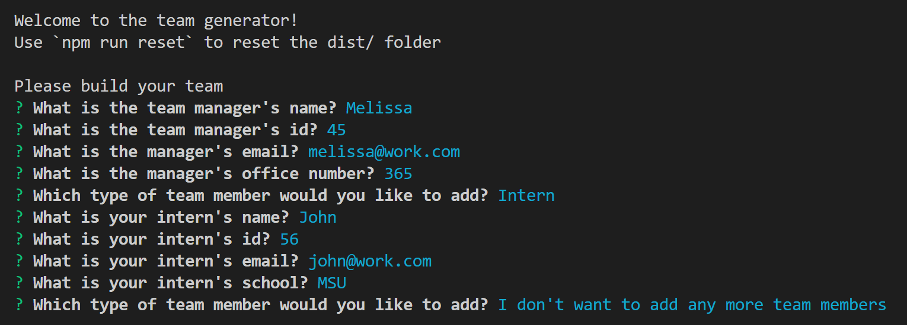
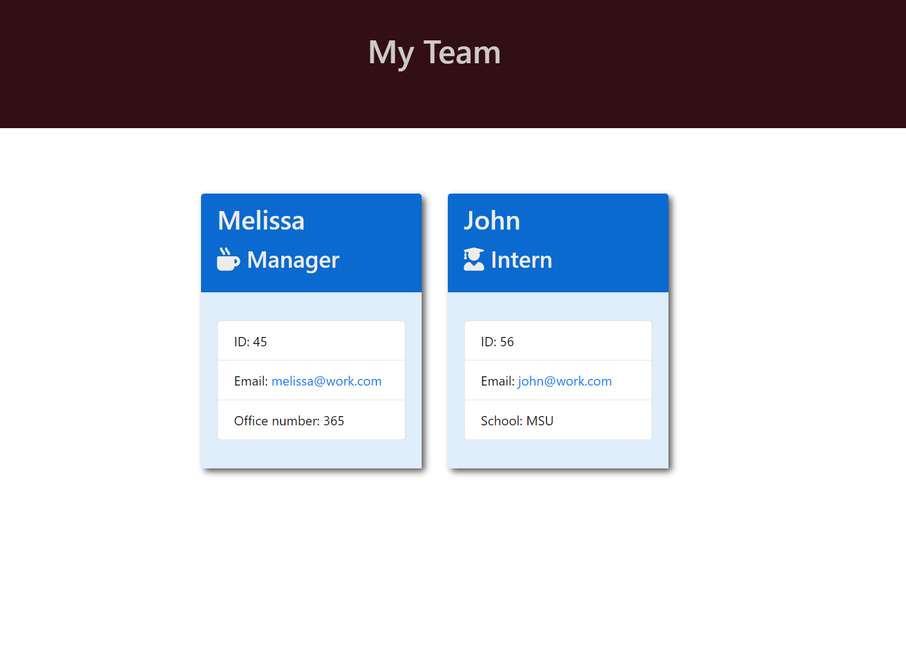

# teamProfile

## Description

This app allows someone to track their employees titles, names, email addresses, phone numbers, and office numbers. The user can add data in the console and see it in the browser. 

Tests were created to ensure the functionality of the app. 

## Installation

Do an npm install, npm start, and prompts will appear in the console. 

## Usage

Follow the prompts in the console. 

After employee information has been entered open the browser through the team.html document and the browser version can be seen. 

## Credits

Used past assignments to help with code.

github: https://github.com/Melissagon/teamProfile
Video walkthrough: https://app.castify.com/view/4431b38a-3b0d-4325-ba5f-885536f0c653